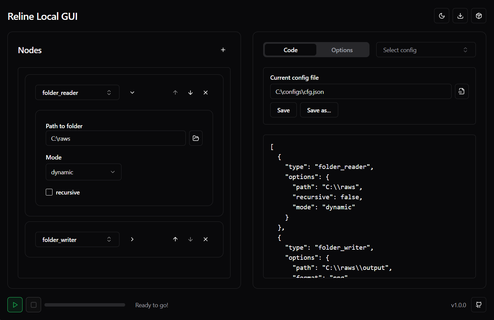

# Reline Local GUI

---

<div align="center">
  
</div>

## EN

## Description

> **Reline Local GUI** is the offline version of [configurator.yor.ovh](https://configurator.yor.ovh), allowing you to generate and instantly run a config file in a local environment.

---

## Building
Clone this repo, then install the dependencies with<br>
```npm install``` <br>

To launch it, run:<br>
```npm run go``` <br>

To build it run: <br>
```npm run dist``` for Windows<br>
```npm run distlin``` for Linux<br>

---

## RU

## Описание

> **Reline Local GUI** — это оффлайн-версия [configurator.yor.ovh](https://configurator.yor.ovh), которая позволяет создавать конфиги и сразу запускать их выполнение в локальной среде.

---

## Сборка

Склонируйте репозиторий, затем установите зависимости через:<br>
```npm install``` <br>

Для запуска, выполните:<br>
```npm run go```<br>

Для сборки выполните: <br>
```npm run dist``` для Windows<br>
```npm run distlin``` для Linux<br>


